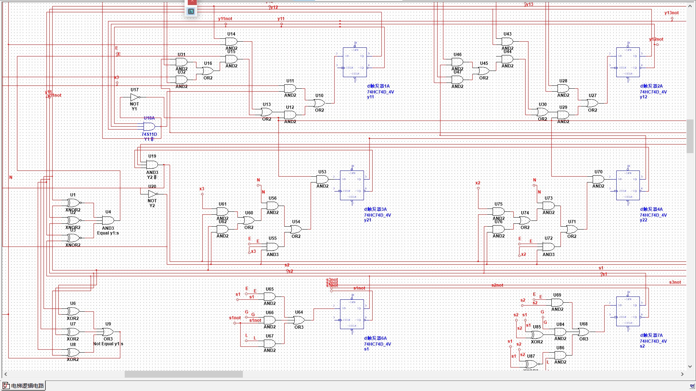

<center><h3>电梯控制时序逻辑设计</h3></center>

[toc]
#### 成员及分工
组长:
华佳彬 负责时序线路逻辑构思设计,仿真代码实现及仿真检验分析，设计报告撰写
组员:
崔林浩 负责逻辑电路设计与绘制
胡君皓 负责展示ppt制作
张佳鹏 负责ppt展示讲解
#### 功能介绍
&nbsp;&nbsp;&nbsp;&nbsp;&nbsp;&nbsp;&nbsp;&nbsp;电梯控制时序逻辑设计，模拟电梯运行的时序逻辑，接收目的楼层输入，同时用队列逻辑FIFO(First In First Out)实现了多人使用时的排队控制.
#### 设计过程
##### 变量定义
时序线路定义的变量如下:
|逻辑变量|实际含义|位数,表示范围|
|:-:|:-:|:-:|
|$S$|当前楼层|3,[1,7]|
|$X$|输入楼层|3,[0,7]|
|$y_1$|目标楼层|3,[0,7]|
|$y_2$|等待目标楼层|3,[0,7]|
&nbsp;&nbsp;&nbsp;&nbsp;&nbsp;&nbsp;&nbsp;&nbsp;为简化设计过程的繁琐度,所有变量用3位表示,等待队列容量为2.(该规模状态表已经足够庞大,同时能够基本实现电梯上下运行的排队控制)其中除 $S$ 没有0值外,其他变量为0时表示无效值,即不用响应.
##### 队列原理
&nbsp;&nbsp;&nbsp;&nbsp;&nbsp;&nbsp;&nbsp;&nbsp;$y_1$ 表示目标楼层,即当前楼层需要前往的楼层, $y_2$ 存储的是当前前往楼层未到达时候的楼层输入. 若用0和1表示 $y_1y_2$ 值是否有效,故有3种可能,分别为 00,10,11.时序逻辑为 $X$ 每次会进入最左边的无效值即进入队尾.而当 $X$ 进入时, 即意味着最左边的有效值被移出队首,而移出队首的原因即当前楼层到达了目标楼层,即 $S$ 等于 $y_1$.总体逻辑如上,除此之外还需要考虑当后三个变量出现无效值的处理.
##### 次态转移
对于$y_1^{n+1}$, $y_1$ 如果为0时,直接将 $X$ 赋值给 $y_1^{n+1}$,否则先判断 $S$ 与 $y_1$ 是否相等,不相等则不变.相等时若 $y_2$ 值有效即不为0时,将 $y_2$ 赋值给 $y_1^{n+1}$,若 $y_2$为0,则将 $X$ 赋值给 $y_1^{n+1}$.
对于$y_2^{n+1}$,$y_1$ 不为0时才有可能需要用到 $y_2$,因此当$y_1$不为0时,如果 $y_1$ 与 $S$ 不相等, $y_2$ 有有效值时不变,否则将 $X$ 赋值给 $y_2^{n+1}$. 如果 $y_1$ 与 $S$ 相等且 $y_2$值有效,此时  $y_2$ 的值被赋给了 $y_1^{n+1}$, 而 $X$ 赋给 $y_2^{n+1}$.
对于 $S$, 当 $y_1$值有效时,只需要向目标楼层加一或减一即可,若相等则不变.
##### 次态表达式
由于次态表达式较为复杂,将复用表达式记为记号.
记 $T_{A}$ 为 $A$ 不为0,即 $T_{A}=A_3+A_2+A_1$
记 $F_{A}$ 为 $A$ 为0,即 $F_{A}=\overline{A_3}\ \overline{A_2}\ \overline{A_1}$
记 $E_{A,B}$ 为 $A=B$, 即 $E_{A,B}=(A_3\odot B_3)(A_2\odot B_2)(A_1\odot B_1)$
记 $N_{A,B}$ 为 $A!=B$, 即 $N_{A,B}=A_3\oplus B_3+A_2\oplus B_2+A_1\oplus B_1$
记 $G_{A,B}$ 为 $A>B$, 即 $G_{A,B}=A_3A_2A_1\overline{B_3B_2B_3}+A_3A_2\overline{A_1}(B_3\overline{B_2}+\overline{B_3})+A_3\overline{A_2}A_1(B_3\overline{B_2}\ \overline{B_1}+\overline{B_3})+A_3\overline{A_2}\ \overline{A_1}\ \overline{B_3}+\overline{A_3}A_2A_1(\overline{B_3}B_2\overline{B_1}+\overline{B_3}\ \overline{B_2})+\overline{A_3}A_2\overline{A_1}\ \overline{B_3}\ \overline{B_2}$
记 $L_{A,B}$ 为 $A<B$, 即 $L_{A,B}=N_{A,B}\overline{G_{A,B}}$
由于表达式使用的 $G_{y_1,S}$ 的 $S$ 的取值范围不包括0,故表达式省略了一项. 
次态表达式如下:
$$
y_{13}^{n+1}=F_{y_1}X_3+T_{y_1}(N_{y_1,S}y_{13}+E_{y_1,S}(T_{y_2}y_{23}+F_{y_2}X_3))\\
y_{12}^{n+1}=F_{y_1}X_2+T_{y_1}(N_{y_1,S}y_{12}+E_{y_1,S}(T_{y_2}y_{22}+F_{y_2}X_2))\\
y_{11}^{n+1}=F_{y_1}X_1+T_{y_1}(N_{y_1,S}y_{11}+E_{y_1,S}(T_{y_2}y_{21}+F_{y_2}X_1))\\
y_{23}^{n+1}=T_{y_1}(N_{y_1,S}(F_{y_2}X_3+T_{y_2}y_{23})+E_{y_1,S}T_{y_2}X_3)\\
y_{22}^{n+1}=T_{y_1}(N_{y_1,S}(F_{y_2}X_2+T_{y_2}y_{22})+E_{y_1,S}T_{y_2}X_2)\\
y_{21}^{n+1}=T_{y_1}(N_{y_1,S}(F_{y_2}X_1+T_{y_2}y_{21})+E_{y_1,S}T_{y_2}X_1)\\
S_3^{n+1}=F_{y_1}S_3+T_{y_1}(E_{y_1,S}S_3+G_{y_1,S}(S_3+S_2S_1)+L_{y_1,S}S_3(S_1+S_2))\\
S_2^{n+1}=F_{y_1}S_2+T_{y_1}(E_{y_1,S}S_2+G_{y_1,S}(S_2\oplus S_1)+L_{y_1,S}(S_2\odot S_1))\\
S_1^{n+1}=F_{y_1}S_1+T_{y_1}(E_{y_1,S}S_1+G_{y_1,S}\overline{S_1}+L_{y_1,S}\overline{S_1})
$$
##### 状态转移表
完整状态表共有$8*7*(1+7*8)=3192$行，在此节选前100列。(完整状态转移表见附件xlsx文件)
|$X$|$S$|$y_1$|$y_2$|$S^{n+1}$|$y_1^{n+1}$|$y_2^{n+1}$|
|:-:|:-:|:-:|:-:|:-:|:-:|:-:|:-:|
|0|1|0|0|1|0|0|
|0|1|1|0|1|0|0|
|0|1|1|1|1|1|0|
|0|1|1|2|1|2|0|
|0|1|1|3|1|3|0|
|0|1|1|4|1|4|0|
|0|1|1|5|1|5|0|
|0|1|1|6|1|6|0|
|0|1|1|7|1|7|0|
|0|1|2|0|2|2|0|
|0|1|2|1|2|2|1|
|0|1|2|2|2|2|2|
|0|1|2|3|2|2|3|
|0|1|2|4|2|2|4|
|0|1|2|5|2|2|5|
|0|1|2|6|2|2|6|
|0|1|2|7|2|2|7|
|0|1|3|0|2|3|0|
|0|1|3|1|2|3|1|
|0|1|3|2|2|3|2|
|0|1|3|3|2|3|3|
|0|1|3|4|2|3|4|
|0|1|3|5|2|3|5|
|0|1|3|6|2|3|6|
|0|1|3|7|2|3|7|
|0|1|4|0|2|4|0|
|0|1|4|1|2|4|1|
|0|1|4|2|2|4|2|
|0|1|4|3|2|4|3|
|0|1|4|4|2|4|4|
|0|1|4|5|2|4|5|
|0|1|4|6|2|4|6|
|0|1|4|7|2|4|7|
|0|1|5|0|2|5|0|
|0|1|5|1|2|5|1|
|0|1|5|2|2|5|2|
|0|1|5|3|2|5|3|
|0|1|5|4|2|5|4|
|0|1|5|5|2|5|5|
|0|1|5|6|2|5|6|
|0|1|5|7|2|5|7|
|0|1|6|0|2|6|0|
|0|1|6|1|2|6|1|
|0|1|6|2|2|6|2|
|0|1|6|3|2|6|3|
|0|1|6|4|2|6|4|
|0|1|6|5|2|6|5|
|0|1|6|6|2|6|6|
|0|1|6|7|2|6|7|
|0|1|7|0|2|7|0|
|0|1|7|1|2|7|1|
|0|1|7|2|2|7|2|
|0|1|7|3|2|7|3|
|0|1|7|4|2|7|4|
|0|1|7|5|2|7|5|
|0|1|7|6|2|7|6|
|0|1|7|7|2|7|7|
|0|2|0|0|2|0|0|
|0|2|1|0|1|1|0|
|0|2|1|1|1|1|1|
|0|2|1|2|1|1|2|
|0|2|1|3|1|1|3|
|0|2|1|4|1|1|4|
|0|2|1|5|1|1|5|
|0|2|1|6|1|1|6|
|0|2|1|7|1|1|7|
|0|2|2|0|2|0|0|
|0|2|2|1|2|1|0|
|0|2|2|2|2|2|0|
|0|2|2|3|2|3|0|
|0|2|2|4|2|4|0|
|0|2|2|5|2|5|0|
|0|2|2|6|2|6|0|
|0|2|2|7|2|7|0|
|0|2|3|0|3|3|0|
|0|2|3|1|3|3|1|
|0|2|3|2|3|3|2|
|0|2|3|3|3|3|3|
|0|2|3|4|3|3|4|
|0|2|3|5|3|3|5|
|0|2|3|6|3|3|6|
|0|2|3|7|3|3|7|
|0|2|4|0|3|4|0|
|0|2|4|1|3|4|1|
|0|2|4|2|3|4|2|
|0|2|4|3|3|4|3|
|0|2|4|4|3|4|4|
|0|2|4|5|3|4|5|
|0|2|4|6|3|4|6|
|0|2|4|7|3|4|7|
|0|2|5|0|3|5|0|
|0|2|5|1|3|5|1|
|0|2|5|2|3|5|2|
|0|2|5|3|3|5|3|
|0|2|5|4|3|5|4|
|0|2|5|5|3|5|5|
|0|2|5|6|3|5|6|
|0|2|5|7|3|5|7|
|0|2|6|0|3|6|0|
|0|2|6|1|3|6|1|
##### 逻辑电路
逻辑电路设计全部采用D触发器，在时钟上升沿触发。
**整体**

**局部左**

**局部右**

#### 仿真检验
##### verilog代码实现
电梯控制模块
```verilog
`timescale 1ns / 1ps

module Elevator(S,y1,y2,X,clk,res);
input clk,res;
input[2:0] X;
output y1,y2,S;
reg[2:0] y1,y2,S;

always@(posedge clk)
if(~res)begin                   // 复位赋初始状态
    S <= 3'b001;
    y1 <= 3'b000;
    y2 <= 3'b000;
end
else begin
    if (y1==3'b000)begin        
        y1 = X;
    end
    else begin
        //y1==S 即到达目的楼层
        if(y1==S)begin           
            if(y2!=3'b000)begin
                y1 = y2;
                y2 = X;
            end
            else begin
                y1 = X;
            end
        end         
        else begin 
        // y1!=S 即未到达目的楼层             
        if(y2==3'b000)begin
            y2 = X;
        end
        end
    end
    // 对 S 当前楼层进行上下移动
    if (y1!=3'b000)begin
        if(y1>S)begin
            S = S+1;
        end
        else if(y1<S)begin
            S = S-1;
        end
    end
 end
endmodule

```
testbench测试模块
```verilog
`timescale 1ns / 1ps

module Elevator_tb;
reg clk,res;
reg[2:0] X;
wire[2:0] S,y1,y2;
// 模块实例化
Elevator Elevator(.S(S),.y1(y1),.y2(y2),.clk(clk),.res(res),.X(X));

initial begin
   clk <= 0;res <= 0;X <= 0;
   #10 res<=1;
   #5 X <= 2;
   #10 X <= 5;
   #10 X <= 3;
   #10 X <= 0;
   #40 X <=1 ;
   #10 $stop;
end
// 每隔10时钟单位进行一次激励
always #5 clk<=~clk;
endmodule

```
##### 仿真结果

状态转移表如下:
|$clk$|$S$|$y_1$|$y_2$|$X$|
|:-:|:-:|:-:|:-:|:-:|
|5 $ns$|1|0|0|0|
|15 $ns$|2|2|0|2|
|25 $ns$|3|5|0|5|
|35 $ns$|4|5|3|3|
|45 $ns$|5|5|3|0|
|55 $ns$|4|3|0|0|
|65 $ns$|3|3|0|0|
|75 $ns$|3|0|0|0|
|85 $ns$|2|1|0|1|
##### 仿真分析:
&nbsp;&nbsp;&nbsp;&nbsp;&nbsp;&nbsp;&nbsp;&nbsp;15 $ns$ 时输入为2, 电梯往上运行到2楼;25 $ns$ 时输入为5,同时上一目的地已经到达, 5楼成为当前目标,电梯往上运行到3楼;35 $ns$ 时,输入为3,但是当前目标为 5,故仍向上运行到4楼,并将3楼作为等待的下一个目标楼层.45 $ns$ 时,电梯向上运行到5楼,成功到达目的地,此时无输入;55 $ns$ 时,同样无输入,上一次等待的目的楼层3楼变成当前目的楼层,并往下运行至4楼;65 $ns$ 时,向下运行到目的楼层3楼,仍无输入,此时目的楼层和下一个目的楼层皆为无效值0;75 $ns$ 时,无输入,电梯停在3楼;85 $ns$ 时,输入为1,电梯启动向下运行.

&nbsp;&nbsp;&nbsp;&nbsp;&nbsp;&nbsp;&nbsp;&nbsp;可以从上述仿真结果看到,该时序逻辑线路实现了基本的电梯上下运行控制,并能够对多人使用进行有效的排队控制.